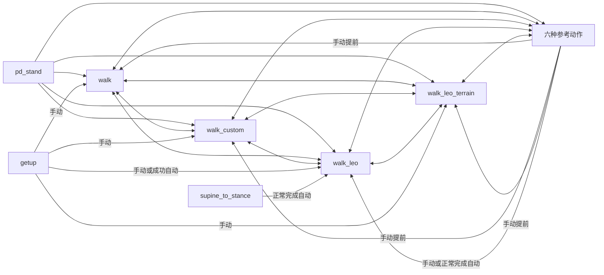

# T800 动作状态切换与无空挡衔接说明

## 1. 目标和结论

本次修改为 T800 的四个行走状态和六种参考动作策略增加了统一的“目标状态入口衔接”。`walk_leo` 与 `walk_leo_terrain` 复用同一个 Leo runner，仅通过 `param_tag` 加载不同配置。核心原则是：

1. 切换后，下一个策略从第一个控制周期就开始推理，不设置“等待策略启动”的空挡阶段。
2. 电机命令从上一个状态最后实际下发的完整命令平滑过渡到下一个策略的实时输出。
3. 下一个动作的参考首帧或 walk 默认姿势只作为短时、衰减的姿态引导，不替代策略输出。
4. 衔接时间根据切换瞬间的最大关节位置差自动调整，同时由最大时长限制，避免过慢切换长时间压制策略。
5. 同时衔接 `q_des`、`qd_des`、`Kp`、`Kd` 和 `tau_ff`，衔接结束后严格等于下一个策略的实时命令。

这不是在两个策略之间插入第三个“无策略状态”。衔接器是下一个 runner 内部的命令整形层，整个衔接期间下一个策略一直运行。

## 2. 本次覆盖的状态

### 2.1 四种行走状态

| 状态 | 按键 | runner | 控制周期 | 控制频率 |
| --- | --- | --- | ---: | ---: |
| `walk` | `LB + B` | `rl_walking_example_runner` | 0.01 s | 100 Hz |
| `walk_custom` | `LB + X` | `rl_walking_custom_example_runner` | 0.01 s | 100 Hz |
| `walk_leo` | `LB + Y` | `rl_walking_leolab_example_runner` | 0.02 s | 50 Hz |
| `walk_leo_terrain` | `LB + 十字键上` | `rl_walking_leolab_example_runner` | 0.02 s | 50 Hz |

四种 walk 状态所用的三个 runner 都在入口应用统一衔接，因此只要状态机允许切入，来源可以是参考动作、getup、SDK 起身、`pd_stand` 或另一种 walk；衔接不依赖来源状态名称。terrain 状态复用 Leo runner 后会自动走同一套入口逻辑，无需复制一份衔接实现。

### 2.2 六种参考动作状态

| 状态 | 按键 | runner | 控制周期 | 控制频率 |
| --- | --- | --- | ---: | ---: |
| `dance` | `RB + B` | `rl_dance_example_runner` | 0.02 s | 50 Hz |
| `victory` | `RB + Y` | `rl_dance_example_runner` | 0.02 s | 50 Hz |
| `punch` | `RB + 十字键上` | `rl_dance_example_runner` | 0.02 s | 50 Hz |
| `zhiquan_combo` | `RB + 十字键下` | `rl_dance_example_runner` | 0.02 s | 50 Hz |
| `kick_540cut` | `RB + 十字键右` | `rl_dance_example_runner` | 0.02 s | 50 Hz |
| `zhiquan_base` | `RB + 十字键左` | `rl_dance_example_runner` | 0.02 s | 50 Hz |

六种动作共用同一个 runner，通过不同的 `param_tag` 加载模型和参考轨迹。它们的入口统一使用参考轨迹第 0 帧作为短时姿态引导。

## 3. 状态机与衔接覆盖

状态边仍由 `assets/config/t800/task_motion/default.yaml` 决定。新增的 `walk_leo_terrain` 按现有 walk 的权限接入；命令衔接仍由目标 runner 内部完成。



### 3.1 已使用统一入口衔接的边

| 切换方向 | 是否衔接 | 入口参考 | 说明 |
| --- | --- | --- | --- |
| 四种 walk 相互切换 | 是 | 目标 walk 的默认姿势 | 目标 walk 策略从第一个周期运行 |
| 四种 walk → 六种参考动作 | 是 | 目标动作参考轨迹第 0 帧 | 动作策略运行，但轨迹帧暂时保持在第 0 帧 |
| `pd_stand` → 四种 walk | 是 | 目标 walk 默认姿势 | 来源是 `pd_stand` 最后实际命令 |
| `pd_stand` → 六种参考动作 | 是 | 目标动作第 0 帧 | 由动作 runner 在入口衔接 |
| 六种参考动作 → 四种 walk（手动提前） | 是 | 目标 walk 默认姿势 | 使用按键生效时动作的实时末端命令，不要求动作到固定末帧 |
| 六种参考动作正常完成 → `walk_leo` | 是 | `walk_leo` 默认姿势 | 状态机自动切换，来源是动作最后实际下发的命令 |
| `getup` → 四种 walk（手动） | 是 | 目标 walk 默认姿势 | 无论 getup 是否成功，状态机允许人工切换；动态可行性由操作者负责判断 |
| `getup` 成功 → `walk_leo`（自动） | 是 | `walk_leo` 默认姿势 | 保留当前自动目标 |
| `supine_to_stance` 正常完成 → `walk_leo` | 是 | `walk_leo` 默认姿势 | 由 `walk_leo` 入口完成衔接 |

### 3.2 本次未接入统一衔接的边

以下目标状态没有接入本次共享入口衔接，继续使用其自身原有逻辑：

- 切入 `passive`、`idle`、`pd_stand`、`getup`、`stance_to_supine`、`supine_to_stance`。
- 参考动作手动切到 `passive` 或 `pd_stand`。
- walk 手动切到 `passive`、`pd_stand`、`getup` 或 `stance_to_supine`。

其中 `pd_stand` 已有自己的姿态插值机制；`passive` 属于主动卸力语义，不应被本次策略命令衔接改变。起身和躺下策略的入口需要结合接触状态单独设计，不在本次范围内。

## 4. 每次切换的真实执行时序

### 4.1 通用时序

目标 runner 进入时：

1. 从 `JointInfo` 捕获上一个状态最后持有的完整命令：`q`、`qd`、`Kp`、`Kd`、`tau_ff`。
2. 同时读取切换瞬间的实测 `q`、`qd`。
3. 如果上一个位置命令与实测位置相差过大，按 `entry_transition_source_tracking_error` 将起点限制在实测位置附近，避免从陈旧命令开始插值。
4. 初始化目标策略及其内部状态。

目标 runner 的每一个控制周期都按以下顺序执行：

1. 读取最新机器人状态。
2. 组装 observation。
3. 执行下一个策略推理，得到本周期实时目标命令。
4. 入口衔接器将“上一个状态命令快照”平滑混合到“本周期目标策略命令”。
5. 将衔接后的完整命令发送到底层。

因此衔接期间不存在故意保持零输出、只做定时等待或停止策略计算的阶段。即使是 recurrent 的 `walk_leo`，hidden/cell 也从第一个周期开始随 observation 更新。

### 4.2 进入参考动作时

参考动作进入衔接期间：

- 策略每周期正常推理。
- 参考轨迹固定在第 0 帧，不提前消耗动作轨迹。
- 第 0 帧只作为衰减引导，策略实时输出仍参与最终命令。
- 衔接完成后，`policy_step` 才按 50 Hz 正常递增。

这样既利用参考动作的合理初始姿势，又不会先花 0.1～0.5 秒做纯插值、随后才突然启动策略。

### 4.3 从参考动作提前切回 walk 时

手动提前切换不依赖动作固定末帧：

- 按键被状态机接受的那个时刻，目标 walk runner 捕获参考动作最后实际下发的命令。
- walk 策略立即开始运行。
- walk 默认姿势只提供短时引导。
- 即使动作执行到一半也能完成命令连续的切换。

需要区分“命令连续”和“动力学上一定可站稳”：如果在腾空、单脚高速旋转或质心明显越界时强行从 `kick_540cut` 等动作切出，任何短时插值都不能保证接触条件立刻可行。实机上仍应尽量选择双脚稳定接触的切换时机。

### 4.4 参考动作正常结束时

六种参考动作使用 `trajectory_end_behavior: exit`。轨迹到末帧后 runner 请求退出，状态机自动进入 `walk_leo`。`walk_leo` 捕获的是动作末尾真正下发的命令，而不是另存的一份固定末帧，因此自动结束和手动提前结束走同一套入口衔接逻辑。

## 5. 衔接算法

使用五次平滑函数：

```text
alpha(s) = 10*s^3 - 15*s^4 + 6*s^5,  s ∈ [0, 1]
```

它在起点和终点的一阶、二阶导数均为 0，适合控制命令的短时桥接。

设：

- `q_source`：上一个状态最后命令的固定快照。
- `q_policy(t)`：下一个策略在当前周期的实时输出。
- `q_reference`：动作第 0 帧或 walk 默认姿势。
- `w`：`entry_transition_reference_pose_weight`。

参考引导随衔接进度衰减：

```text
q_guided = lerp(q_policy(t), q_reference, w * (1 - alpha))
q_cmd    = lerp(q_source, q_guided, alpha)
```

当 `alpha = 1` 时，输出被显式赋值为当前实时策略目标，参考姿势和浮点误差都不会残留。

`qd` 同时包含端点速度混合和五次路径导数，并按配置的最大关节速度裁剪。`Kp`、`Kd`、`tau_ff` 使用同一个 `alpha` 混合，避免只平滑位置但增益或前馈力矩瞬间跳变。

## 6. 自适应时长

衔接器在获得下一个策略第一帧实时目标后，根据最大初始关节差 `delta_q` 计算建议时长：

```text
T_velocity     = 1.875 * delta_q / max_joint_velocity
T_acceleration = sqrt(5.7735 * delta_q / max_joint_acceleration)
T_requested    = max(nominal_duration, min_duration,
                     T_velocity, T_acceleration)
T_actual       = clamp(T_requested, min_duration, max_duration)
```

当前 T800 参数：

| 参数 | walk | 参考动作 | 含义 |
| --- | ---: | ---: | --- |
| `entry_transition_enabled` | `true` | `true` | 是否启用入口衔接 |
| `entry_transition_duration` | 0.16 s | 0.16 s | 名义时长 |
| `entry_transition_min_duration` | 0.10 s | 0.10 s | 最短时长 |
| `entry_transition_max_duration` | 0.28 s | 0.28 s | 最长时长，防止过慢切换 |
| `entry_transition_max_joint_velocity` | 8.0 rad/s | 8.0 rad/s | 时长估算和 `qd` 裁剪参考 |
| `entry_transition_max_joint_acceleration` | 120.0 rad/s² | 120.0 rad/s² | 时长估算参考 |
| `entry_transition_reference_pose_weight` | 0.25 | 0.35 | 参考姿势初始引导权重 |
| `entry_transition_source_tracking_error` | 0.75 rad | 0.75 rad | 来源命令相对实测位置的最大初始偏差 |

T800 配置显式开启了该功能。其他机型如果没有配置这些新字段，不会因为本次 T800 修改被无条件开启；普通 walk 和参考动作仅保留各自旧参数所表达的兼容行为。

对应控制周期数量：

- `walk` / `walk_custom`：名义 16 个周期，范围 10～28 个周期。
- `walk_leo`、`walk_leo_terrain` 和六种参考动作：名义 8 个周期，范围 5～14 个周期。

当关节差过大、理论所需时间超过 0.28 s 时，系统会打印 `Entry transition required ... capped at 0.28s`。这是“不要让策略被压制太久”的主动上限；此时速度/加速度估算约束不再保证满足。实机若频繁出现该日志，优先检查切换时机和两个策略的姿态兼容性，再考虑适当增加 `entry_transition_max_duration`。

## 7. 参数调节建议

建议每次只调整一组参数，并保存切换时的关节命令、实测关节和接触状态。

### 7.1 切换仍然太硬

按以下顺序调整：

1. 将 `entry_transition_duration` 从 0.16 s 增加到 0.18～0.22 s。
2. 如果日志显示 duration 被速度或加速度约束自动拉长，先不要继续增大名义时长。
3. 如果频繁出现 0.28 s 封顶警告，可将 `entry_transition_max_duration` 小幅提高到 0.32～0.36 s，但必须重新检查策略接管是否过慢。
4. 若动作入口方向不自然，可小幅提高该动作的 `entry_transition_reference_pose_weight`，不建议直接超过 0.5。

### 7.2 策略接管感觉太慢

1. 先降低 `entry_transition_duration`，例如 0.16 s → 0.12～0.14 s。
2. 保留 `entry_transition_min_duration` 至少 0.08～0.10 s，避免只有少数控制周期。
3. 不要先增大 `max_joint_velocity` 或 `max_joint_acceleration`；这会放宽保护含义，而且在实机上更难定位冲击来源。
4. 不建议通过将参考权重设为 0 来解决慢接管；参考权重只影响早期路径，主要接管速度由时长决定。

### 7.3 上一个命令与实测位置差异大

出现 `Outgoing position command differs from measured state` 表示来源命令可能陈旧，或机器人没有跟上命令。此时衔接起点会自动限制在实测位置 ±0.75 rad 内，但这只是防止使用明显错误的起点，不是跟踪故障修复。应检查：

- 状态切换前是否已经失稳或发生碰撞。
- 仿真/实机控制周期是否超时。
- Kp/Kd、关节方向、关节顺序和模型输出缩放是否一致。
- 实机是否有电机限流、限速或通信延迟。

## 8. 仿真与实机一致性

本次衔接位于 runner 输出到 `SetCommand` 之前，仿真和实机走同一份 C++ 命令生成路径，也使用相同 YAML 参数。这样能保证算法和状态机逻辑一致。

但以下物理差异仍然存在：

- 实机电机带宽、减速器间隙、摩擦和通信延迟。
- 地面摩擦、足底柔顺性和接触冲击。
- 电池电压、力矩/电流限制、IMU 噪声。
- 参考动作中单脚支撑、腾空和高速旋转阶段的动态可行性。

因此“仿真命令连续”不能直接等价为“实机一定不摔”。本次实现减少的是软件命令突变和无策略等待，不会替代接触安全判定或动作相位门控。

## 9. 已知边界

1. `entry_transition_max_joint_acceleration` 当前用于根据第一帧位置差估算时长，不是对每个周期实时变化的策略目标做硬 `qdd` 裁剪。
2. `tau_ff`、`Kp`、`Kd` 已做平滑混合，但没有对最终闭环总力矩 `Kp*(q_des-q)+Kd*(qd_des-qd)+tau_ff` 做逐周期硬限幅或 `delta_tau` 限制。
3. 来源命令快照在整个衔接期间固定；实测状态持续作为策略 observation，并用于入口陈旧命令检查，但不会每周期重新定义插值起点。
4. 手动从高速动作中途退出时，软件允许切换且命令连续，但没有基于双脚接触、质心或角动量判断“安全退出窗口”。
5. 0.28 s 最大时长优先保证及时策略接管；在大姿态差情况下可能牺牲配置的速度/加速度估算目标，并明确打印警告。

后续若做第二阶段实机增强，优先考虑记录并限制最终 `delta_tau`、增加足底接触/动作相位退出门控，以及用实测跟踪误差动态缩放衔接速度。

## 10. 实机验证顺序

1. 仿真中将遥控速度置零，逐一验证四种 walk 相互切换。
2. 验证四种 walk 分别进入六种参考动作，并等待动作自动回 `walk_leo`。
3. 在参考动作前半段和后半段分别手动切回四种 walk，观察是否出现 0.28 s 封顶或 tracking error 日志。
4. 吊架/保护绳下实机测试 `pd_stand → walk_leo`、`walk_leo ↔ walk_custom`。
5. 再测试低动态动作，最后测试 punch、combo、kick 的手动提前退出。
6. 只有在零速切换稳定后，再逐步加入行走速度命令。

重点记录：切换来源/目标、切换时动作帧、双脚接触、`q_cmd-q_real` 最大值、衔接实际 duration、是否触发封顶警告，以及是否触发电机限流。

## 11. 代码位置

- 共享衔接器：`src/runner/motion_transition/`
- 普通 walk 接入：`src/runner/rl_walking_example/`
- custom walk 接入：`src/runner/rl_walking_custom_example/`
- Leo Lab recurrent walk 接入：`src/runner/rl_walking_leolab_example/`
- 六种参考动作接入：`src/runner/rl_dance_example/`
- T800 参数：`assets/config/t800/rl_*_example/default.yaml`
- T800 状态机：`assets/config/t800/task_motion/default.yaml`

## 12. 验证结果

- 共享衔接器单元测试覆盖：首周期命令连续且策略持续更新、参考姿势仅作衰减引导、自适应时长。
- 在项目官方 Docker 环境中，四种 walk 状态复用的三个 walk runner、参考动作 runner 和共享衔接模块均已完成目标编译。
- 所有修改过的 YAML 均应在部署前再次随目标模型做一次加载和仿真冒烟测试；模型本身的 observation、action、关节顺序和缩放契约不由衔接器改变。
